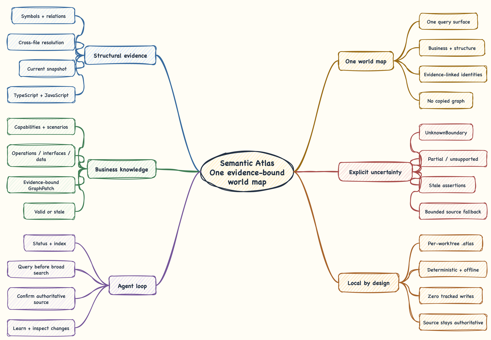

<div align="center">
  <h1>Semantic Atlas</h1>
  <p><strong>Give your coding agent the business map a senior engineer keeps in their head.</strong></p>
  <p>Navigate by capabilities and behavior, confirm the responsible code, and retain what real engineering work proves.</p>

  <p>
    <a href="https://www.npmjs.com/package/semantic-atlas"></a>
    <a href="https://github.com/lzj960515/semantic-atlas/actions/workflows/ci.yml"></a>
    <a href="https://www.npmjs.com/package/semantic-atlas"></a>
    <a href="./LICENSE"></a>
  </p>

  <p><strong>English</strong> · <a href="./README.zh-CN.md">简体中文</a></p>
</div>

## Code search is not a project understanding model

A file tree tells an agent where code is stored. Keyword search tells it where a
word appears. Neither tells it the complete business area affected by a product
change.

That gap is why an agent can find the obvious service and still miss a policy,
consumer, data dependency, or test elsewhere in the repository. Semantic Atlas
adds the missing layer: a local, evidence-bound business graph connected to the
code that realizes it.

| Starting point | What the agent sees |
| --- | --- |
| File tree | `src/`, `libs/`, packages, modules, and implementation layout |
| Keyword search | Files containing the words chosen for this task |
| Semantic Atlas | Business regions, behavior, rules, data, collaborators, tests, and their source evidence |

The goal is not to replace source inspection. It is to make the agent enter the
source through the right business boundary and leave verified understanding
behind for the next task.

## One map, continuously learned



Semantic Atlas keeps one business graph that can be viewed at different semantic
zoom levels:

```text
Commerce
└── Orders  ─────────────────── works with ─── Customers
    ├── Checkout
    │   └── Place order ─────── reads ───────── Customer profile
    └── After-sales
        └── Refund eligibility ─ constrained by Refund policy
```

`map view` starts at the current world regions. Focusing a region reveals its
children, breadcrumbs, and summarized cross-region connections. The agent keeps
zooming until the operation, data, rule, or test relevant to the task becomes
visible. This is one canonical map projected at the current level, not a large
overview plus a collection of disconnected detail maps.

The map grows during normal engineering work:

1. The agent queries what the project already knows.
2. Missing knowledge routes it to bounded structural evidence and source.
3. The agent implements or investigates the real task and verifies the result.
4. Only durable business meaning proven by current source is learned.
5. The next task starts with a better map.

`index` publishes code structure; it does not guess a repository-wide business
model. A newly indexed project can honestly have an empty business map. The first
relevant task may introduce a provisional root such as "Refund eligibility".
Later work can discover "After-sales" and "Orders" above it and reparent the
existing node without changing its stable identity or evidence.

## What the agent actually does

Suppose a product request changes refund eligibility. A Semantic Atlas-aware
agent follows this path:

```text
status
  -> refresh the structural snapshot when needed
  -> view/search the business map
  -> zoom into the refund region and inspect its evidence
  -> use bounded code search only for gaps
  -> confirm behavior in source and tests
  -> make and verify the change
  -> reindex, inspect semantic changes, and retain durable knowledge
```

Without an existing refund region, the same workflow begins with a small
`code search` result instead of pretending that folders are business concepts.
Once the task establishes the capability, rules, and relationships, later agents
can navigate there directly.

This workflow is delivered as one product:

- The **Semantic Atlas Skill** teaches compatible coding agents when to query,
  return to source, and retain knowledge.
- The **`semantic-atlas` CLI** provides deterministic local JSON operations.
- The structural analyzer remains an internal evidence provider. Its directory
  graph, CLI, storage schema, and terminology do not become the business map.

## Install

Semantic Atlas supports Node.js 22.12 through 24 and Git repositories containing
TypeScript or JavaScript.

```sh
npm install --global semantic-atlas
semantic-atlas setup
semantic-atlas --version
semantic-atlas -h
```

`setup` atomically installs the Skill bundled with the current package at
`~/.agents/skills/semantic-atlas`. Re-running it verifies the managed copy and
repairs local changes. A recognized legacy copy at
`~/.codex/skills/semantic-atlas` is removed only after the shared installation
succeeds.

Indexing, querying, and learning stay local and make no model or network calls.
npm access is used only to install or upgrade Semantic Atlas.

### Upgrade

```sh
semantic-atlas upgrade
```

`upgrade` checks npm's latest stable release, installs that exact resolved
version globally, verifies the newly installed CLI, and runs the new package's
`setup`. When the package is already current, it still verifies and synchronizes
the managed Skill. The command is repository-independent: it does not discover a
Git project or open Atlas data.

## First project

The bundled Skill normally drives these commands for the agent. They are shown
here to make the lifecycle explicit. Run Atlas commands serially in the exact
target worktree:

```sh
semantic-atlas status
semantic-atlas index
semantic-atlas map view
semantic-atlas map search "checkout" --limit 10
semantic-atlas map view commerce/orders
semantic-atlas map show commerce/orders/checkout
```

If `status` reports `missing`, `stale`, or an incomplete structural backend, run
`index` before querying. If a current world returns `regions: []` with
`BUSINESS_KNOWLEDGE_EMPTY`, the project has no verified business knowledge yet.
The agent then uses a bounded fallback:

```sh
semantic-atlas code search "CheckoutService" --limit 10
```

Project commands write one versioned JSON envelope to standard output and keep
diagnostics on standard error. `setup`, `upgrade`, `-h`/`--help`, and `--version`
are repository-independent text commands.

## Trust model

Semantic Atlas is useful because it preserves the line between evidence and
understanding:

- **Source remains authoritative.** Answer-controlling and change-controlling
  behavior is confirmed in the checked-out code.
- **Business facts carry evidence.** Learned nodes and relations bind to source
  symbols, ranges, content hashes, certainty, and a repository snapshot.
- **Change invalidates confidence visibly.** Evidence that can no longer be
  rebound becomes `stale`; it is not silently retained as current truth.
- **Uncertainty stays explicit.** Dynamic dispatch, reflection, unsupported
  structure, hypotheses, and unresolved targets route the agent back to source.
- **The target project stays untouched.** Atlas does not edit source, run tests,
  or operate Git. Generated worktree state is ignored and disposable.

## Local storage

```text
~/.semantic-atlas/repositories/<repository-id>/
└── atlas.db                    durable repository business knowledge

<worktree>/.atlas/
├── .gitignore
└── codegraph.db                disposable structural projection
```

Business knowledge is shared across worktrees of the same repository. Structural
state is separate because each worktree can contain a different commit or dirty
source. A new worktree can bootstrap from a compatible sibling projection and
then synchronize incrementally. Removing a worktree removes only its disposable
projection.

Set an absolute `SEMANTIC_ATLAS_HOME` when tests or CI need isolated durable
state.

## Evidence from the frozen evaluation

The retained [`fresh-agent-v1` report](evaluation/results/fresh-agent-v1/report.json)
contains 12 paired location and dependency-impact cases across NestJS, GraphQL,
TypeORM, and BullMQ, for 24 fresh-agent runs.

| Metric | Without Atlas | With Atlas | Fixture result |
| --- | ---: | ---: | --- |
| Final-answer correctness | 100% | 100% | No regression |
| Required-file recall | 100% | 100% | No regression |
| Required-symbol recall | 100% | 100% | No regression |
| Median unique source files opened | 6.5 | 4 | 38.46% fewer |
| Median observed source-input tokens | 1,351 | 688 | 49.07% fewer |

These are fixture-scoped results, not a claim of universal business accuracy or
total model-token savings. Read the [evaluation protocol](docs/evaluation.md)
before interpreting them.

## Command reference

```text
semantic-atlas setup
semantic-atlas upgrade
semantic-atlas -h | --help
semantic-atlas --version

semantic-atlas status [--repo <path>] [--pretty]
semantic-atlas index [--repo <path>] [--pretty]
semantic-atlas map view [business-key] [--repo <path>] [--pretty]
semantic-atlas map search <business-term> [--limit <n>] [--repo <path>] [--pretty]
semantic-atlas map show <business-key> [--repo <path>] [--pretty]
semantic-atlas code search <structural-term> [--limit <n>] [--repo <path>] [--pretty]
semantic-atlas learn --stdin [--repo <path>] [--pretty]
semantic-atlas changes [--from <snapshot-id>] [--to <snapshot-id>] [--repo <path>] [--pretty]
```

Field-level behavior is defined by the versioned [CLI v1](docs/contracts/cli-v1.md)
and [GraphPatch v1](docs/contracts/graph-patch-v1.md) contracts.

## Develop

```sh
corepack enable
pnpm install --frozen-lockfile
pnpm typecheck
pnpm test
pnpm build
pnpm package:verify
```

`package:verify` installs the packed artifact outside the source checkout and
runs the real CLI. `validation:backend` adds structural projection, recovery,
evidence rebinding, sibling bootstrap, and worktree-isolation gates.

## Read next

- [Product contract](docs/product-contract.md)
- [Continuous business learning and semantic zoom](docs/architecture/continuous-business-learning.md)
- [Graph model](docs/contracts/graph-model.md)
- [CLI v1 contract](docs/contracts/cli-v1.md)
- [Evaluation protocol](docs/evaluation.md)

## License

Semantic Atlas is released under the [MIT License](LICENSE).
