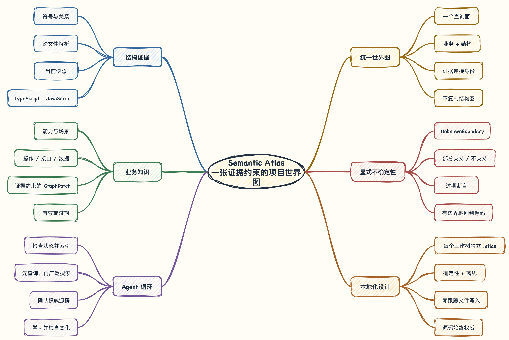

<div align="center">
  <h1>Semantic Atlas</h1>
  <p><strong>把资深工程师脑中的业务地图，交给你的 AI 编程 Agent。</strong></p>
  <p>从业务能力和行为出发，逐层定位负责代码，并把真实工程任务验证过的理解保留下来。</p>

  <p>
    <a href="https://www.npmjs.com/package/semantic-atlas"></a>
    <a href="https://github.com/lzj960515/semantic-atlas/actions/workflows/ci.yml"></a>
    <a href="https://www.npmjs.com/package/semantic-atlas"></a>
    <a href="./LICENSE"></a>
  </p>

  <p><a href="./README.md">English</a> · <strong>简体中文</strong></p>
</div>

## 搜到代码，不等于理解项目

目录树告诉 Agent 代码放在哪里，关键词搜索告诉它某个词出现在哪里，但它们
都无法回答一次产品变更完整涉及哪一块业务。

因此，Agent 即使找到了最明显的 Service，也可能漏掉仓库另一处的规则、消费
方、数据依赖或测试。Semantic Atlas 补上的是这一层：一张本地、受证据约束
的业务图，并且每一块业务理解都能连接回实现它的代码。

| 从哪里开始 | Agent 看见什么 |
| --- | --- |
| 目录树 | `src/`、`libs/`、包、模块和实现布局 |
| 关键词搜索 | 包含本次任务所选词语的文件 |
| Semantic Atlas | 业务区域、行为、规则、数据、协作者、测试和源码证据 |

它不是为了替代源码阅读，而是让 Agent 从正确的业务边界进入源码，并把已经
验证的理解留给下一次任务。

## 一张地图，在工作中持续生长



Semantic Atlas 保存一张业务图，并根据当前视角提供不同的语义缩放层级：

```text
交易
└── 订单  ─────────────────── 协作 ─────── 用户
    ├── 下单
    │   └── 创建订单 ──────── 读取 ─────── 用户资料
    └── 售后
        └── 退款资格 ──────── 受约束于 ─── 退款规则
```

`map view` 先展示当前世界中的业务区域。聚焦一个区域后，会得到它的子区域、
面包屑和聚合后的跨区域关系。Agent 可以继续放大，直到看见本次任务相关的
操作、数据、规则或测试。这是一张权威地图在不同层级的投影，不是一张粗略
大图再加上一堆互相脱节的小图。

这张地图跟随真实工程工作成长：

1. Agent 先查询项目已经知道的业务。
2. 知识不足时，Atlas 把它引导到有边界的结构证据和源码。
3. Agent 完成真实的实现或调查，并验证结果。
4. 只有被当前源码证明、以后仍有复用价值的业务含义才会被学习。
5. 下一个任务从一张更完整的地图开始。

`index` 负责发布代码结构，不会在初始化时猜一套全仓库业务模型。一个刚完成
索引的项目可以诚实地拥有空业务图。第一次相关任务可能先学到一个临时根节点
“退款资格”；后续任务发现它上方还有“售后”和“订单”时，可以把原节点移动
到新的层级中，同时保持稳定身份和证据不变。

## Agent 实际会怎样使用它？

假设产品要修改退款资格。具备 Semantic Atlas 的 Agent 会按下面的路径工作：

```text
status
  -> 必要时刷新结构快照
  -> 查看或搜索业务地图
  -> 放大退款区域并检查证据
  -> 只对地图缺口使用有边界的代码搜索
  -> 回到源码和测试确认行为
  -> 完成修改并验证
  -> 重新索引、检查语义变化、保留可复用知识
```

如果地图中还没有退款区域，同一个流程会从一小组 `code search` 结果开始，
而不会把文件夹冒充成业务。等这次任务确认了能力、规则和关系，后续 Agent
就可以直接从业务地图到达这里。

完整体验由一个产品提供：

- **Semantic Atlas Skill** 告诉兼容的编程 Agent 何时查询、何时回到源码、
  何时保留知识。
- **Semantic Atlas Insights Skill** 承担独立的每日产品复盘和反馈分诊，保证
  常规开发上下文保持聚焦。
- **`semantic-atlas` CLI** 提供确定性的本地 JSON 操作。
- 结构分析器只是内部证据来源，它的目录图、CLI、存储结构和术语不会变成
  对外的业务地图。

## 安装

Semantic Atlas 支持 Node.js 22.12 至 24，以及包含 TypeScript 或 JavaScript
的 Git 仓库。

```sh
npm install --global semantic-atlas
semantic-atlas setup
semantic-atlas --version
semantic-atlas -h
```

`setup` 会把主 Skill 原子安装到 `~/.agents/skills/semantic-atlas`，并把维护
Skill 安装到 `~/.agents/skills/semantic-atlas-insights`。重复执行会校验受管理
副本，并修复本地改动。只有共享目录安装成功后，能够确认为 Semantic Atlas 的旧
`~/.codex/skills/semantic-atlas` 副本才会被删除。

索引、查询和学习全部在本机进行，不会调用模型或网络。只有安装和升级
Semantic Atlas 时需要访问 npm。

### 升级

```sh
semantic-atlas upgrade
```

`upgrade` 会查询 npm 的最新稳定版本，在全局安装这次查询得到的精确版本，
校验新 CLI，再运行新软件包自己的 `setup`。如果软件包已经是最新版，它仍会
校验并同步受管理的 Skill。这个命令不依赖项目：不会发现 Git 仓库，也不会
打开 Atlas 数据。

## 第一个项目

通常由内置 Skill 为 Agent 驱动以下命令；这里把它们列出来，是为了让整个
生命周期一目了然。请在准确的目标 worktree 中串行运行 Atlas 命令：

```sh
semantic-atlas status
semantic-atlas index
semantic-atlas map view
semantic-atlas map search "下单" --limit 10
semantic-atlas map view commerce/orders
semantic-atlas map show commerce/orders/checkout
```

如果 `status` 返回 `missing`、`stale` 或结构后端不完整，先执行 `index`。如果
当前世界返回 `regions: []` 和 `BUSINESS_KNOWLEDGE_EMPTY`，说明项目还没有
经过验证的业务知识。Agent 会明确进入有边界的回退：

```sh
semantic-atlas code search "CheckoutService" --limit 10
```

项目命令向标准输出写入一个带版本的 JSON 信封，诊断信息留在标准错误中。
`setup`、`upgrade`、`-h`/`--help` 和 `--version` 是不依赖仓库的文本命令。

## 产品洞察

正常开发不会多出一个报告步骤。只有源码确认 Atlas 确实阻塞或拖慢了任务时，
主 Skill 才会记录一条精简、带证据上下文的反馈。日常维护由独立的 Insights
Skill 负责：

```sh
semantic-atlas insights summary --period yesterday
semantic-atlas insights feedback --period yesterday --status new
semantic-atlas insights feedback update --stdin
```

本地存储只记录命令名、结果、告警码、耗时、仓库身份和快照身份等客观元数据，
不会记录 prompt、命令参数、查询文本、源码文本或命令输出。它们反映产品使用和
摩擦；需要结合全新 Agent 评测和已由源码确认的反馈，不能单独当成召回率指标。

## 可信边界

Semantic Atlas 的价值来自它始终区分“证据”和“理解”：

- **源码仍是权威。** 影响答案和修改范围的行为，都要在当前检出的代码中确认。
- **业务事实携带证据。** 学到的节点和关系会绑定源码符号、范围、内容哈希、
  确定性和仓库快照。
- **变化会显式降低可信度。** 无法重新绑定的证据会变成 `stale`，不会悄悄
  继续充当当前事实。
- **不确定性保持显式。** 动态分派、反射、不支持的结构、假设和未解析目标
  都会把 Agent 引导回源码。
- **目标项目保持零侵入。** Atlas 不修改源码、不运行测试，也不操作 Git；
  worktree 内的生成状态可丢弃并已被忽略。

## 本地存储

```text
~/.semantic-atlas/repositories/<repository-id>/
└── atlas.db                    仓库级持久业务知识

~/.semantic-atlas/
└── insights.db                 安装级使用与反馈信号

<worktree>/.atlas/
├── .gitignore
└── codegraph.db                可丢弃的结构投影
```

同一仓库的多个 worktree 共享业务知识。结构状态保持独立，因为每个 worktree
可能位于不同提交，或拥有不同的未提交源码。新的 worktree 可以从兼容的兄弟
投影启动，再做增量同步；删除 worktree 只会删除它自己的可丢弃投影。

测试或 CI 需要隔离持久状态时，可以把绝对路径写入
`SEMANTIC_ATLAS_HOME`。

## 冻结评测证据

仓库保留的 [`fresh-agent-v1` 报告](evaluation/results/fresh-agent-v1/report.json)
包含 NestJS、GraphQL、TypeORM 和 BullMQ 上 12 组定位与依赖影响配对案例，
共 24 次全新 Agent 运行。

| 指标 | 不使用 Atlas | 使用 Atlas | 固定 fixture 结果 |
| --- | ---: | ---: | --- |
| 最终答案正确率 | 100% | 100% | 无回退 |
| 必要文件召回率 | 100% | 100% | 无回退 |
| 必要符号召回率 | 100% | 100% | 无回退 |
| 打开的唯一源码文件中位数 | 6.5 | 4 | 减少 38.46% |
| 观测到的源码输入 token 中位数 | 1,351 | 688 | 减少 49.07% |

这些只是固定 fixture 范围内的结果，不代表所有仓库都具有相同业务准确率，
也不等同于模型总 token 节省。解读前请阅读[评测协议](docs/evaluation.md)。

## 命令参考

```text
semantic-atlas setup
semantic-atlas upgrade
semantic-atlas -h | --help
semantic-atlas --version

semantic-atlas status [--repo <path>] [--pretty]
semantic-atlas index [--repo <path>] [--pretty]
semantic-atlas map view [business-key] [--repo <path>] [--pretty]
semantic-atlas map search <business-term> [--limit <n>] [--repo <path>] [--pretty]
semantic-atlas map show <business-key> [--repo <path>] [--pretty]
semantic-atlas code search <structural-term> [--limit <n>] [--repo <path>] [--pretty]
semantic-atlas learn --stdin [--repo <path>] [--pretty]
semantic-atlas changes [--from <snapshot-id>] [--to <snapshot-id>] [--repo <path>] [--pretty]
semantic-atlas feedback report --stdin [--repo <path>] [--pretty]

semantic-atlas insights summary [--period today|yesterday|7d|30d|all] [--pretty]
semantic-atlas insights feedback [--period today|yesterday|7d|30d|all] [--status new|triaged|resolved|dismissed] [--pretty]
semantic-atlas insights feedback update --stdin [--pretty]
```

字段级行为由带版本的 [CLI v1](docs/contracts/cli-v1.md)和
[GraphPatch v1](docs/contracts/graph-patch-v1.md)契约定义。产品洞察和反馈行为
由 [Insights v1](docs/contracts/insights-v1.md) 契约定义。

## 开发

```sh
corepack enable
pnpm install --frozen-lockfile
pnpm typecheck
pnpm test
pnpm build
pnpm package:verify
```

`package:verify` 会在源码检出目录之外安装打包产物，并运行真实 CLI。
`validation:backend` 还会验证结构投影、恢复、证据重绑定、兄弟 worktree 启动
和 worktree 隔离。

## 继续阅读

- [产品契约](docs/product-contract.md)
- [持续业务学习与语义缩放](docs/architecture/continuous-business-learning.md)
- [图模型](docs/contracts/graph-model.md)
- [CLI v1 契约](docs/contracts/cli-v1.md)
- [Insights v1 契约](docs/contracts/insights-v1.md)
- [评测协议](docs/evaluation.md)

## 许可证

Semantic Atlas 使用 [MIT 许可证](LICENSE)发布。
